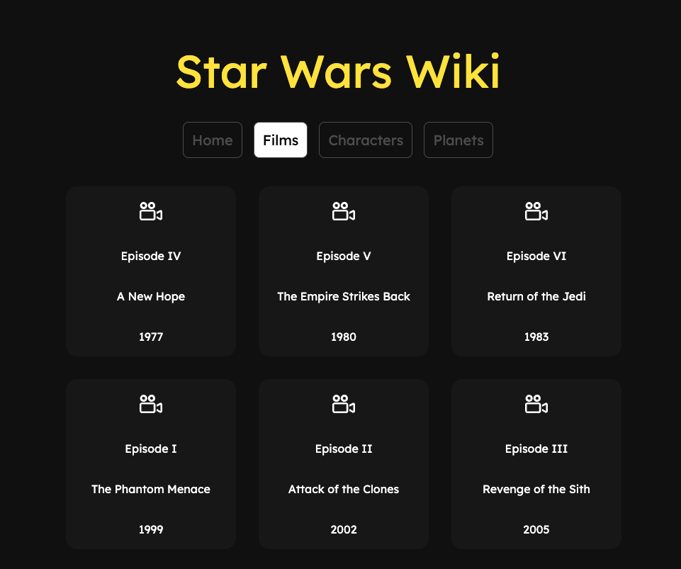

# Star Wars Wiki

## Star Wars Wiki app using Star Wars GraphQL API

<p align="center">
 <a href="#features">Features</a> •
 <a href="#demo">App Preview</a> •
 <a href="#requirements">Requirements</a> •
 <a href="#technologies">Technologies</a> • 
 <a href="#author">Author</a>
</p>

<h4 align="center"> 
	Finished project ✅
</h4>

<h1 id="features">Features</h1>

- [x] Films list and info details
- [x] Characters list and info details
- [x] Planets list and info details

<h1 id="demo">App Preview</h1>

<h1 align="center">
  
</h1>

You can see the app in production [here](https://swapi-green.vercel.app/)

<h1 id="requirements">Requirements</h1>

Before starting, you need to install in your machines the following tools:
[Git](https://git-scm.com), [Node.js](https://nodejs.org/en/).
Besides that, is good to have a good code editor as [VSCode](https://code.visualstudio.com/)

## 🎲 Running the App

```bash
# Clone this repository
$ git clone <https://github.com/leandronunesdev/swapi>

# Access the project folder using terminal/cmd
$ cd swapi

# Install the dependencies
$ npm install

# Execute the application on development mode
$ npm run dev

# The server will start on port:3000 - access <http://localhost:3000>

# Run the tests
$ npm run test

```

<h1 id="technologies">🛠 Technologies</h1>

The following tools were used on this project:

- [Next.JS](https://nextjs.org/)
- [TypeScript](https://www.typescriptlang.org/)
- [Sass](https://sass-lang.com/)
- [Apollo](https://www.apollographql.com/)
- [Star Wars GraphQL API](https://studio.apollographql.com/public/star-wars-swapi/variant/current/home)
- [Jest](https://jestjs.io/)
- [React Test Library](https://testing-library.com/)

<h1 id="author">🛠 Author</h1>

<a href="https://github.com/leandronunesdev">
 
 <br />
 <sub><b>Leandro Nunes</b></sub></a> <a href="https://github.com/leandronunesdev" title="Leandro">🚀</a>

Made with ❤️ by Leandro Nunes

👋🏽 Reach out!

<a href="https://leandronunes.dev/">Website<a> |
<a href="https://www.linkedin.com/in/nunesprofissional/">Linkedin<a> |
<a href="mailto:https://www.linkedin.com/in/nunesprofissional/">E-mail<a> |
<a href="https://twitter.com/leandro_nunes">Twitter<a>
